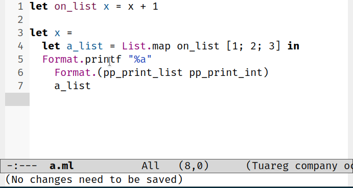

> [!WARNING]
> `ocaml-eglot` is **highly experimental** and at a very early stage
> of development. While we're very happy to collect user feedback,
> **don't overwhelm your OCaml development** environment just yet.

# ocaml-eglot

**`ocaml-eglot`** is a lightweight
[Emacs](https://www.gnu.org/software/emacs/) **minor mode** designed
to enhance the experience of writing OCaml code by leveraging the
[**Eglot**](https://www.gnu.org/software/emacs/manual/html_mono/eglot.html)
[Language Server
Protocol](https://microsoft.github.io/language-server-protocol/) (LSP)
client. This tool specifically caters to the OCaml ecosystem by
implementing canonical custom requests and commands exposed by the
[**`ocaml-lsp-server`**](https://github.com/ocaml/ocaml-lsp).

`ocaml-eglot` bridges the gap between generic LSP support and the
**specific needs of OCaml developers**. Its tight coupling with Eglot
ensures a lightweight experience without sacrificing the advanced
features made available by `ocaml-lsp-server`. Its aim is to offer a
user experience as close as possible to that offered by the Emacs mode
[Merlin](https://ocaml.github.io/merlin/editor/emacs/).

## Features

### Browsing errors

Eglot relies on
[Flymake](https://www.gnu.org/software/emacs/manual/html_node/emacs/Flymake.html)
for error diagnosis. OCaml-eglot offers two functions for quickly
navigating through errors:

- `ocaml-eglot-error-next` (<kbd>C-c</kbd> <kbd>C-x</kbd>): jump to
  the next error
- `ocaml-eglot-error-prev` (<kbd>C-c</kbd> <kbd>C-c</kbd>): jump to
  the previous error

### Jump to definition

Eglot relies on
[Xref](https://www.gnu.org/software/emacs/manual/html_node/emacs/Xref.html)
to index cross-references. OCaml-eglot provides a shortcut to quickly
jump to the definition:

- `ocaml-eglot-locate` (<kbd>C-c</kbd> <kbd>C-l</kbd>): jump to
  definition

### Infer Interface

Used to infer the type of an interface file. If the buffer is not
empty, a prompt will ask for confirmation to overwrite the buffer
contents:

- `ocaml-eglot-infer-interface`: infer the current interface file

### Find Alternate file

OCaml-eglot allows you to quickly switch from the implementation file
to the interface file and _vice versa_. If the interface file does not
exist, a prompt can be used to generate it (using type inference,
based on `ocaml-eglot-infer-inteface`):

- `ocaml-eglot-alternate-file` (<kbd>C-c</kbd> <kbd>C-a</kbd>): switch
  from the implementation file to the interface file and _vice versa_

### Get Documentation

Although the `Hover` primitive in the LSP protocol can be used to
conveiniently display value documentation, it is possible to invoke it
manually:

- `ocaml-eglot-document` (<kbd>C-c</kbd> <kbd>C-d</kbd>): documents
  the expression below the cursor.
- `ocaml-eglot-document-identifier`: enables you to enter an
  identifier (present in the environment) and return its
  documentation.

### Construct Expression

Enables you to navigate between the different types of holes in a
document and interactively subsitute them:

- `ocaml-eglot-hole-next`: jump to the next hole
- `ocaml-eglot-hole-prev`: jump to the previous hole
- `ocaml-eglot-construct`: Opens up a list of valid substitutions to
  fill the hole

If the `ocaml-eglot-construct` command is prefixed by an argument, ie:
`C-u M-x ocaml-eglot-construct`, the command will also search for
valid candidates in the current environment:

